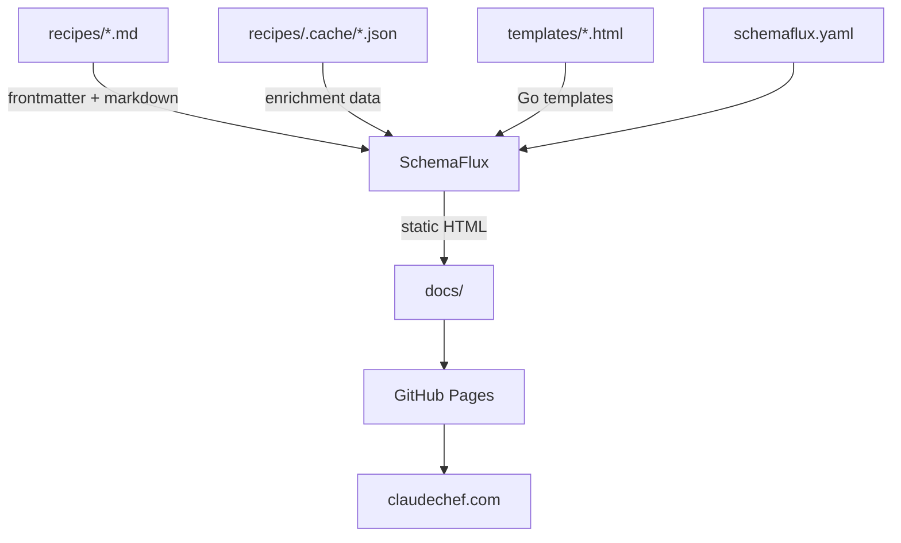

# Claude Chef

[](https://github.com/greynewell/claude-chef/actions/workflows/deploy-site.yml)
[](https://github.com/greynewell/claude-chef/actions/workflows/ci.yml)
[](https://claudechef.com/all/index.html)
[](./LICENSE)
[](https://schemaflux.dev)

29,000+ open-source recipes with AI-powered cooking assistance, built with [SchemaFlux](https://schemaflux.dev).

## Architecture



Recipes are Markdown files with YAML frontmatter. [SchemaFlux](https://schemaflux.dev) compiles them into a fully static site with zero runtime dependencies — no framework, no build step for the output, no client-side libraries.

## Quick Start

```bash
git clone https://github.com/greynewell/claude-chef.git
cd claude-chef
go install github.com/greynewell/schemaflux/cmd/schemaflux@latest
schemaflux build
```

The site is built into `docs/`. Open `docs/index.html` to preview locally.

## Features

- **29,000+ recipes** with structured ingredients, step-by-step instructions, and nutrition info
- **9 taxonomy types** — category, cuisine, ingredient, allergen, flavor, sauce, tool, skill level, contributor
- **AI enrichment** — shopping search terms, gear recommendations, cooking tips, coaching prompts
- **Affiliate shopping** — Amazon and Walmart links for ingredients and gear
- **Servings scaling** — interactive slider adjusts quantities and calories in real time
- **Cook with AI** — one-click prompt for guided cooking with any AI assistant
- **Recipe pairings** — suggested complementary dishes for complete meals
- **SEO** — JSON-LD structured data, Open Graph, sitemaps, RSS feeds, `robots.txt`, `llms.txt`

## CLI Plugin

Claude Chef is also a [Claude Code](https://docs.anthropic.com/en/docs/claude-code) plugin:

```bash
claude install-plugin github:greynewell/claude-chef
```

```
/chef create "Spicy Garlic Noodles"     Create a recipe interactively
/chef modify teriyaki-chicken           Create a variant of an existing recipe
/chef contribute "Grandma's Soup"       Submit a recipe via pull request
/chef enrich spicy-garlic-noodles       Enrich with AI coaching data
/chef preview                           Build and preview locally
/chef report                            Report a bug
/chef request                           Request a feature
```

## Development

### Prerequisites

- Go 1.25+
- [SchemaFlux](https://schemaflux.dev) (`go install github.com/greynewell/schemaflux/cmd/schemaflux@latest`)

### Build

```bash
schemaflux build
```

For affiliate links, set environment variables:

```bash
AMAZON_AFFILIATE_TAG=your-tag-20 WALMART_AFFILIATE_ID=your-id schemaflux build
```

### Project Structure

```
claude-chef/
├── recipes/              # 29,000+ Markdown recipe files
│   └── .cache/           # AI enrichment cache (JSON)
├── templates/            # Go HTML templates (SchemaFlux)
├── static/               # Static assets (OG images)
├── schemaflux.yaml       # Site configuration
├── favorites.json        # Curated favorite recipe slugs
├── contributors.json     # Contributor profile data
├── .claude/commands/     # Claude Code plugin (/chef)
└── docs/                 # Generated site (GitHub Pages)
```

### Recipe Format

```yaml
---
title: Teriyaki Chicken
description: Pan-seared chicken in a sticky teriyaki glaze.
author: Claude Chef Community
prep_time: PT20M
cook_time: PT30M
servings: 4
calories: 500
recipe_category: Main Course
cuisine: Japanese-American
skill_level: Easy
keywords: [chicken, teriyaki]
recipe_ingredients: [Chicken, Teriyaki Sauce]
allergies: [Soy, Dairy]
flavors: [Sweet, Savory, Umami]
sauces: [Teriyaki]
tools: [Skillet, Cutting Board]
pairings: [teriyaki-roasted-broccoli]
---

## Ingredients

- 4 chicken thighs
- 60ml soy sauce

## Instructions

1. Season the chicken...
2. Heat a skillet...
```

## Contributing

### Add a Recipe

The easiest way is with the CLI plugin:

```bash
/chef create "Your Recipe Name"
/chef contribute
```

Or submit via the [web form](https://claudechef.com/contribute.html), which opens a GitHub issue.

You can also add a `.md` file directly to `recipes/` and open a pull request.

### Code Contributions

1. Fork the repository
2. Create a feature branch
3. Run `schemaflux build` to verify
4. Submit a pull request

## Roadmap

See the [Claude Chef Roadmap](https://github.com/users/greynewell/projects/3) for planned milestones and progress.

## Documentation

- [How Claude Chef Works](https://claudechef.com/about.html): features, enrichment, and AI integration
- [Contributing Guide](https://claudechef.com/contribute.html): how to submit recipes
- [SchemaFlux](https://schemaflux.dev): the static site compiler that powers Claude Chef

## License

[CC0-1.0 (Public Domain)](./LICENSE) — No rights reserved.

---

[claudechef.com](https://claudechef.com) | Built with [SchemaFlux](https://schemaflux.dev) | Created by [Grey Newell](https://greynewell.com)
